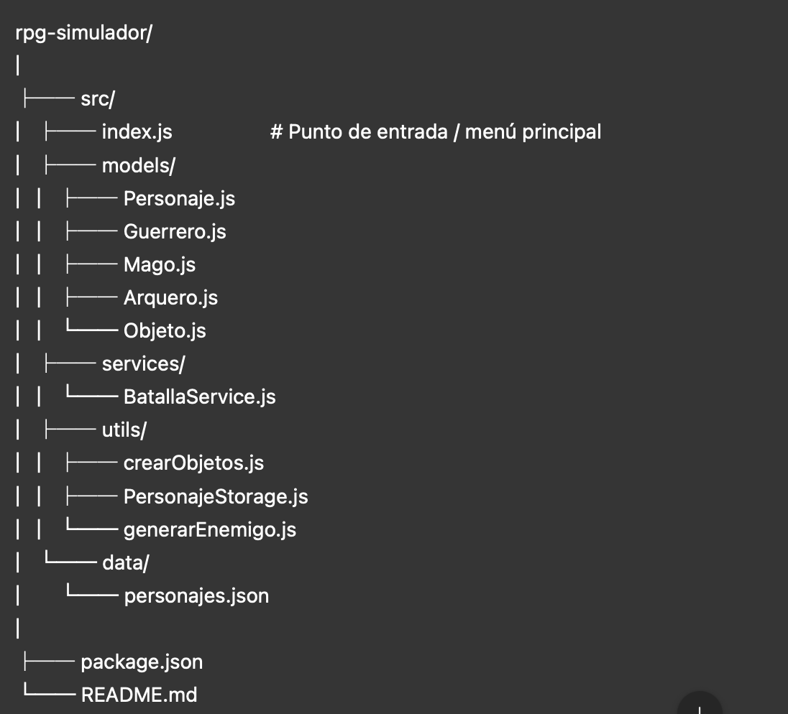

# 🧙 Simulador de Batallas RPG (Node.js CLI)

Simulador de batallas por turnos entre personajes de fantasía, implementado en Node.js usando consola interactiva. Este proyecto pone en práctica conceptos como Programación Orientada a Objetos, patrones de diseño, uso de objetos, lógica de combate, y persistencia de datos.

---

## 🚀 Características principales

- 🎮 Crea personajes de tipo Guerrero, Mago o Arquero
- 🧠 IA básica para enemigos automáticos
- 💥 Simulación de batallas por turnos
- 🧪 Inventario con objetos que modifican atributos
- 💾 Persistencia de datos en archivos JSON
- ✅ Interfaz interactiva con `inquirer`
- 🎨 Salida colorida en consola con `chalk`

---

## 🛠️ Tecnologías usadas

| Tecnología |					 Uso 				                |
|------------|--------------------------------------|
| `Node.js`  | Entorno de ejecución 				        |
| `inquirer` | Menús y prompts interactivos		      |
| `chalk`    | Colores y formato en consola 		    |
| `uuid`     | IDs únicos para personajes y objetos |
| `fs`       | Lectura y escritura en archivos JSON |

---

## 🧩 Funcionalidades principales

### 👤 Crear personajes
- Se elige un nombre y clase.
- Al crearlo, recibe automáticamente 3 objetos personalizados según su clase.

### 📜 Ver personajes
- Lista todos los personajes guardados.
- Se muestra nombre, clase, vida, fuerza y nivel.

### 🎒 Ver inventario
- Seleccionás un personaje y ves los objetos que tiene.
- El inventario se actualiza al usar objetos.

### ⚔️ Iniciar batalla (jugador vs jugador)
- Seleccionás 2 personajes para luchar entre sí.
- Cada uno puede:
  - Atacar
  - Usar habilidad especial
  - Usar un objeto del inventario

### 🤖 Batalla contra enemigo IA
- El juego genera un enemigo aleatorio.
- Vos controlás un personaje propio.
- La IA ataca o usa habilidad especial de forma aleatoria.

---

## 🧪 Objetos y efectos

Los objetos modifican atributos del personaje al obtenerlos o usarlos.

Cada clase recibe objetos únicos:

### 🧙‍♂️ Mago
| Objeto 		    | Tipo 		  | Efecto 					            |
|---------------|-----------|-----------------------------|
| Báculo Arcano | arma 	    | +5 fuerza 				          |
| Poción de Maná| poción 	  | +20 vida 					          |
| Túnica Mágica | armadura  | Reduce daño recibido un 15% |

### 🛡️ Guerrero
| Objeto 		       | Tipo 	  | Efecto 						          |
|------------------|----------|-----------------------------|
| Espada de Hierro | arma 	  | +10 fuerza			            |
| Poción de Vida   | poción   | +30 vida 					          |
| Armadura Pesada  | armadura | Reduce daño recibido un 30% |

### 🏹 Arquero
| Objeto 			      | Tipo 	   | Efecto 					          |
|-------------------|----------|----------------------------|
| Arco Largo 		    | arma     | +7 fuerza 					        |
| Poción de Agilidad| poción.  | +15 vida 					        |
| Botas Ligeras 	  | armadura | Reduce daño recibido un 10%|

---

## 🧠 IA del Enemigo

- Durante batallas automáticas, el enemigo:
  - Ataca o usa habilidad especial de forma aleatoria
- No usa objetos (por simplicidad)

---

## 🧬 Clases de Personaje

| Clase    | Vida | Fuerza | Habilidad Especial       |
|-------   |------|--------|---------------------     |
| Guerrero | 120  | 15     | Ataque Furioso (x2 daño) |
| Mago     | 80   | 8      | Bola de Fuego (x3 daño)  |
| Arquero  | 100  | 12     |Flecha Precisa (x1.5 daño)|

---

## ✨ Habilidades Especiales y Maná

Cada personaje posee una **habilidad especial única**, la cual consume maná. Si no se tiene suficiente maná, el personaje no podrá ejecutarla.

| Clase       | Habilidad Especial     | Efecto                                         | Costo de Maná  |
|-----------  |------------------------|------------------------------------------------|----------------|
| 🗡️ Guerrero | Ataque Furioso         | Doble daño físico al enemigo                   | 15             |
| 🧙‍♂️ Mago     | Bola de Fuego          | Inflige daño mágico x3                         | 20             |
| 🏹 Arquero  | Flecha Precisa         | Daño aumentado con bonificación por precisión  | 10             |

🔋 Todos los personajes inician con una cantidad de maná base (Guerrero: 30, Mago: 60, Arquero: 40).

⚠️ Si el personaje no tiene suficiente maná, se notificará y perderá el turno si intentó usar la habilidad.

---

## 💾 Persistencia

- Los personajes y su inventario se guardan en:  
  `src/data/personajes.json`

- Al salir y volver a entrar, se conserva:
  - Su estado
  - Nivel
  - Vida
  - Objetos

- Si querés **eliminar todos los personajes**:
  - Borrá el archivo `personajes.json`
  - O implementá una función `Eliminar personaje` desde el menú

---

## 📁 Estructura del Proyecto




---

## 🧠 Principios SOLID aplicados

| Principio                       | Aplicación                                                                                                  |
|---------------------------------|-------------------------------------------------------------------------------------------------------------|
| SRP (Responsabilidad Única)     | Cada clase tiene una sola responsabilidad: combate, personaje, almacenamiento, etc.                         |
| OCP (Abierto/Cerrado)           | Nuevas clases u objetos se agregan sin modificar lo existente                                               |
| LSP (Sustitución de Liskov)     | Guerrero/Mago/Arquero se usan igual que su padre `Personaje`                                                | 
| ISP (Segregación de interfaces) | Cada clase sólo implementa lo que necesita                                                         			    | 
| DIP (Inversión de dependencias) | Las dependencias se abstraen (por ejemplo, `BatallaService` depende de personajes, no de clases específicas)|

---


### 🛠️ Sugerencias futuras
	•	Guardado en base de datos SQLite o MongoDB
	•	Clases desbloqueables al subir de nivel
	•	Combate multijugador online con sockets
	•	Sistema de misiones o campañas


## ✅ Cómo ejecutar el proyecto

```bash
# 1. Instalar dependencias
npm install

# 2. Ejecutar la app
npm start

🧑 Autor

Hecho con pasión por batallas mágicas y Node.js 💥
Desarrollado por ! DANIEL ARAUZ !